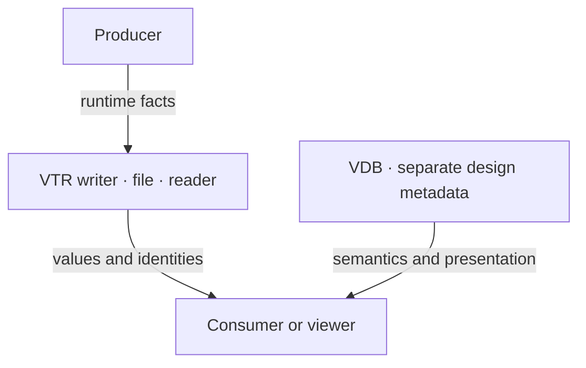

**VTR (Volna Trace Record)** stores runtime facts from hardware simulation in one
file. The library owns trace writing, reading, recovery, and derived activity
indexes. The format is experimental; version fields identify an encoding and do
not promise compatibility.

## What a recording contains

| Data | Purpose |
| --- | --- |
| Metadata | Time unit, time-zero offset, producer, and typed attributes |
| Hierarchy | Scopes, variables, streams, generators, and enum tables |
| Waveforms | 2-, 4-, and 9-state bit vectors, reals, byte strings, aliases, and events |
| Transactions | Intervals, attributes, events, stages, parents, and directed relations |
| Logs | Timestamped records of declared sites with typed arguments |
| Clocks | Declared steady edge stretches represented by ordinary transactions |

Names and runtime identities let a consumer attach design metadata without
modifying the trace. Log-site source provenance is the narrow source-location
exception.

## Trace and application boundaries

VDB, viewers, simulator adapters, conversion tools, servers, and C bindings are
outside this crate. This checkout implements the trace layer. The diagram shows
component responsibilities, not a claim that the application layers are present
in this workspace.

## Container structure

<figure class="v-figure">

<figcaption>Logical file order. Block widths are schematic and do not represent payload sizes.</figcaption>
</figure>

Every section has a 24-byte header and a payload. The writer appends the directory
and trailer at close. If a trailer is missing or invalid, recovery scans complete
sections and stops at the first invalid or incomplete section. The
[container specification](./specification/#2-container) defines the exact rules.

## Start a recording

Follow [getting started](./getting-started/) for a waveform round trip, or
[structured logging](./logging/) to record messages. Explicitly close the writer
to observe errors. A file mapped by a reader must remain unchanged for that
reader's lifetime.

The [design rationale](./rationale/) explains the storage decisions. The
[file-format specification](./specification/) is normative; Rust API contracts
live in rustdoc.
