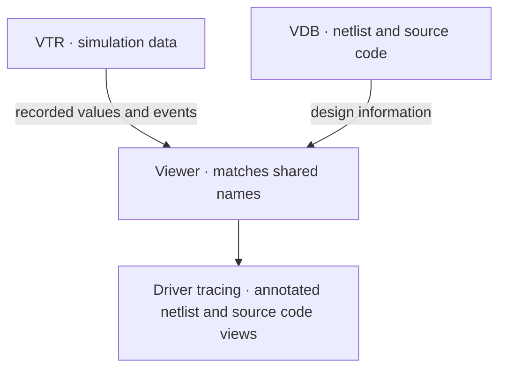
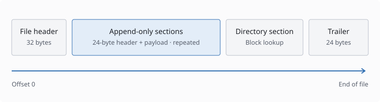

# VTR — Versatile Trace Record

**VTR (Versatile Trace Record)** is a hardware simulation trace format that combines
signal waveforms and transactions in a single trace file,
as many commercial simulators do. Conceptually, think of it as
[FST (Fast Signal Trace)](https://github.com/gtkwave/libfst) for waveforms and
[FTR (Fast Transaction Recording)](https://github.com/Minres/LWTR4SC) for
transactions, combined in one file using VTR's own unified encoding.

A VTR recording contains:

| Data | Purpose |
| --- | --- |
| Metadata | Time scale, time origin, producer identity, and typed attributes |
| Hierarchy | Scopes, variables, signal aliases, streams, generators, and enum tables |
| Waveforms | Value changes of 2-, 4-, and 9-state bit vectors, reals, and byte strings; event occurrences |
| Transactions | Timed intervals with typed attributes, point events, stages, parent links, and directed relations |
| Logs | Timestamped log messages with typed arguments and shared call-site metadata |
| Clocks | Clock edges grouped into intervals with a constant period |

The library provides streaming writes with optional background encoding,
LZ4/Zstandard compression, and checksums. It can recover complete sections after
an interrupted write. For reading and queries, it provides memory-mapped random
access, owned immutable histories, hierarchy counts, and a rebuildable activity
index stored alongside the trace.

## Trace and application boundaries

VTR is designed to work alongside a **VDB (Versatile Data Base)**. VTR records
what happened during simulation; VDB provides design information such as the
netlist and source code. Together, they allow tools to trace signal drivers,
annotate netlist and source code views with recorded values, and build other
features that connect simulation behavior to the design.

The two files are linked through shared names. Full hierarchical paths identify
scopes and variables; stream and generator names, attribute keys, event and stage
names, lane names, and relation kinds identify other recorded objects and their
meaning. A consumer uses these names to associate VTR data with the corresponding
VDB information.



## Container structure

<figure class="v-figure">
<div class="v-figure__canvas" tabindex="0" role="region" aria-label="Scrollable VTR container schematic">

</div>
<figcaption>Logical file order. Block widths are schematic and do not represent payload sizes.</figcaption>
</figure>

VTR stores metadata, strings, hierarchy declarations, waveform data, transactions,
logs, and blackout intervals in append-only sections. Each section has a 24-byte
header followed by its payload.

When recording finishes, the writer appends a directory that indexes the preceding
sections, then a trailer that points to the directory. This lets readers locate
data without scanning the whole file. If writing is interrupted, readers recover
complete sections by scanning from the start.

See the [container specification](docs/SPEC.md#2-container) for field layouts,
section ordering, and recovery rules.

## Quick start

See the [runnable waveform API example](examples/waveform.rs) for a complete
write-and-read round trip.

<!-- include-code: examples/waveform.rs rust -->

`Writer` accepts non-decreasing waveform times; transaction/log timestamps
have their own ordering rules. `Reader` is `Send + Sync`. Do not modify or
truncate a file while it is memory-mapped by a reader; see the safety contract
in `Reader::open_with`. Explicitly call `Writer::close` to observe write errors
rather than relying on `Drop`.

## Documentation and examples

- `cargo doc -p vtr --no-deps --open`: build and open the Rust API documentation,
  including query costs, ordering, and ownership.
- [File-format specification](docs/SPEC.md): container, encodings, recovery,
  and the activity sidecar.
- [Design rationale](docs/RATIONALE.md): format and library boundaries.
- [Structured logging](docs/LOGGING.md): typed sites, records, and queries.
- `examples/waveform.rs`: minimal waveform round trip.
- `examples/logging.rs`: logs alongside transactions, read back three ways.

Run examples from the workspace root (the output path is optional):

```sh
cargo run -p vtr --example waveform -- /tmp/waveform.vtr
cargo run -p vtr --example logging -- /tmp/logging.vtr
```

## Building and testing

Requires Rust 1.85+ and a C compiler for Zstandard. All Rust dependencies come
from crates.io; there are no path dependencies on other project components.

```sh
cargo test -p vtr --locked
cargo test -p vtr --all-targets --locked
cargo fmt --all -- --check
cargo clippy -p vtr --all-targets --locked -- -D warnings
RUSTDOCFLAGS="-D warnings" cargo doc -p vtr --no-deps --locked
```

`src/` contains unit tests and executable rustdoc examples. `tests/` covers
round trips, aliases, late hierarchy declarations, logs, clocks, recovery,
sealing, and activity-index correctness and memory bounds. Historical Verilator
output is checked in under `tests/fixtures/verilator`; tests need neither
Verilator nor the prototype repository.
